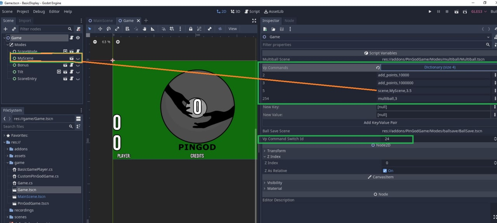

# pingod-basic-display
---

This game project is a test to use PinGod without writing C# script. 

The dev can assign 1-255 options to add points, play scenes and run multiballs from VP with one command from tables script.

The trough is kept intact and managed, ball saves, changing players etc.

### Game.tscn

In the scene inspector you can find `Vp Commands`. The number is sent from VP which sends command in PinGod.

Here you would add your own to invoke from VP.



| Command | Description |
| --- | --- |
| add_points | adds points to current player |
| scene | play a pre made scene |
| multiball | start multiball with ball count |

You add these into the `VP Commands` of `int,string` (see image)

| Key(int) | Value(string) |
| --- | --- |
| 2 | add_points,10000 |
| 3 | add_points,1000000 |
| 5 | scene,MyScene,3.5 |
| 254 | multiball,3 |

```
2 add_points,10000
3 add_points,1000000 ' 
5 scene,MyScene,3.5 ' plays MyScene for 3.5 seconds
254 multiball,3 'starts a 3 ball multiball
```

The switch to listen for is in the inspector under `Vp Command Switch Id` which defaults to 24

### Visual Pinball
---

Send Controller.Switch 24 with the command number, enable a timer to act like pulse switch to set it to zero.

```

' start a multiball
Command 254 

'add 1 million to the player on screen
Command 3

Sub Command(num)
	Controller.Switch 24, num
	vpcommand.enabled = 1
End Sub

Sub vpcommand_timer
	Controller.Switch 24, 0
	vpcommand.enabled = 0
End Sub
```